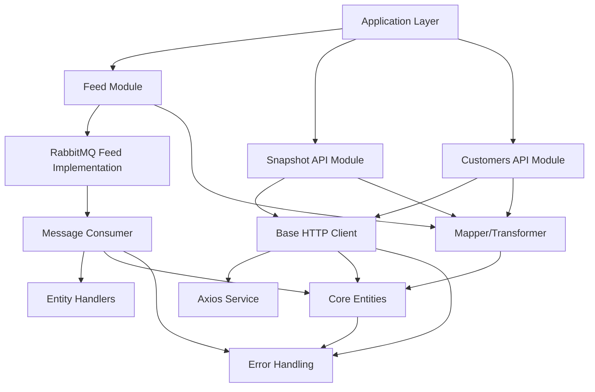
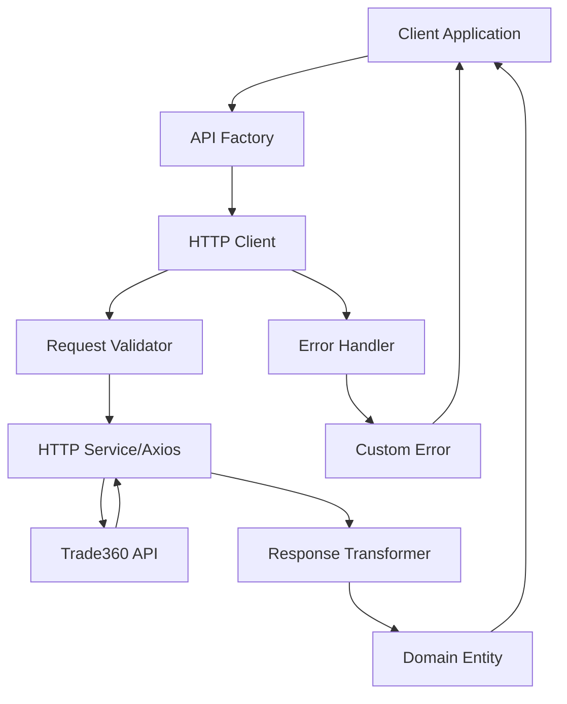
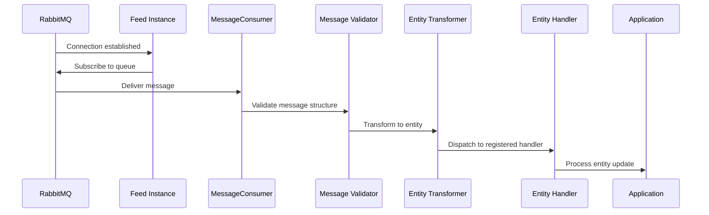
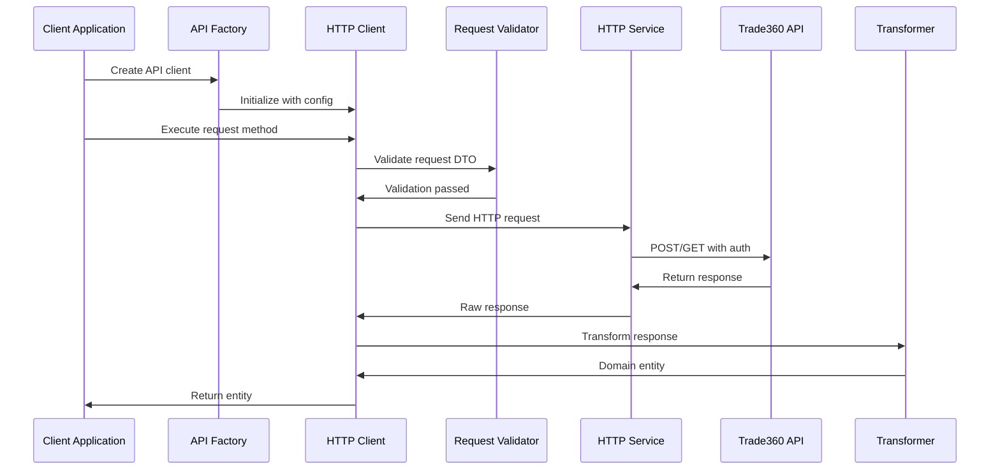
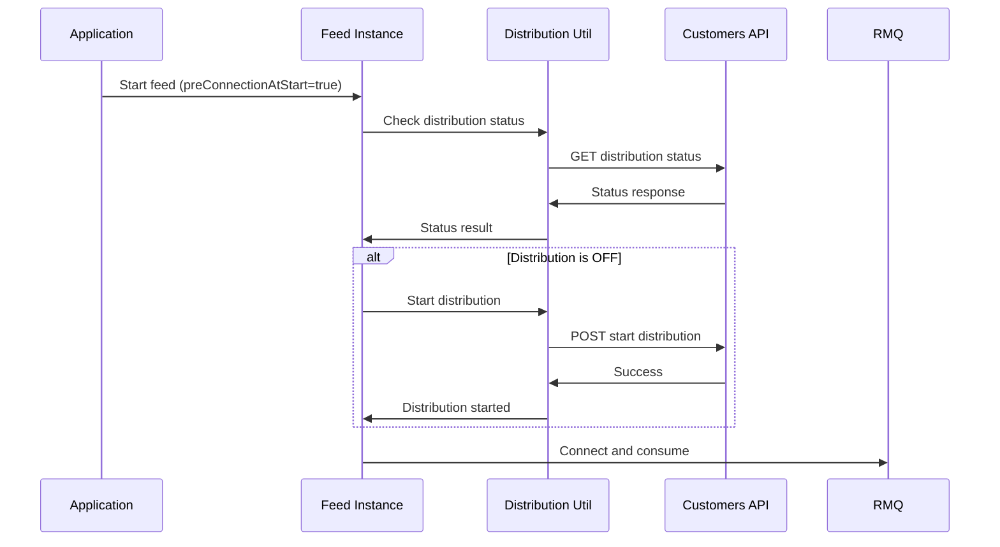
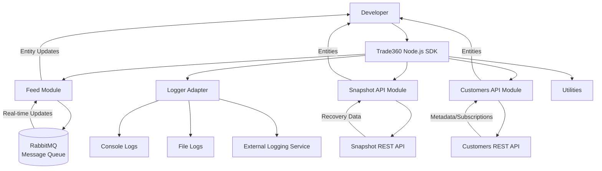

# LSports Trade360 Node.js SDK

## 🧾 Project Brief

**Description:**  
The Trade360 Node.js SDK is a comprehensive TypeScript library designed to simplify integration with LSports Trade360 services. This SDK provides a unified interface for connecting to the Trade360 real-time message feed (via RabbitMQ), interacting with the Snapshot API for data recovery, and managing customer subscriptions and metadata through the Customers API.

**Role in STM Ecosystem:**  
The SDK serves as the primary integration layer for Node.js/TypeScript applications in the Trade360 ecosystem, enabling developers to:
- Consume real-time sports data feeds (in-play and pre-match)
- Retrieve snapshot data for recovery scenarios
- Manage subscriptions and metadata programmatically
- Handle various message types including fixtures, livescores, markets, settlements, and outright events

---

## ⚙️ Tech Context

**Technologies & Frameworks:**
- **Runtime:** Node.js (Recommended: Latest LTS version)
- **Language:** TypeScript (compiled to JavaScript)
- **Package Manager:** npm
- **Testing Framework:** Jest with ts-jest
- **Code Quality:** ESLint (Airbnb TypeScript config), Prettier
- **Build Tool:** TypeScript Compiler (tsc) with tsc-alias for path resolution

**Core Dependencies:**
- **amqplib** (^0.10.4) - RabbitMQ client for message queue integration
- **axios** (^1.8.2) - HTTP client for REST API interactions
- **class-transformer** (^0.5.1) - Object transformation and validation
- **lodash** (^4.17.21) - Utility functions
- **reflect-metadata** (^0.2.2) - Metadata reflection for decorators
- **zod** (^3.23.8) - Schema validation
- **moment** (^2.30.1) - Date/time manipulation
- **winston** (^3.14.2) / **pino** (^9.4.0) / **bunyan** (^1.8.15) - Logging adapters

**Infrastructure:**
- RabbitMQ message broker for real-time data feeds
- RESTful APIs for snapshot and customer management
- Docker support for containerized deployment
- CI/CD via Azure DevOps pipelines

---

## 📘 Overview

The SDK processes data through three main pathways:

1. **Feed Consumption:** Connects to RabbitMQ message queues, consumes real-time updates (fixtures, livescores, markets, settlements), validates messages, and dispatches them to registered entity handlers. Supports automatic reconnection and distribution management.

2. **Snapshot API:** Provides HTTP-based data retrieval for recovery scenarios. Allows querying fixtures, markets, livescores, and settlements by various filters (sport, location, league, fixture IDs) with support for both in-play and pre-match contexts.

3. **Customers API:** Manages subscriptions (start/stop distribution, subscribe/unsubscribe to fixtures or leagues), retrieves metadata (sports, leagues, locations, markets, translations, venues, cities, states, participants), and handles manual suspensions.

Data flows from Trade360 services → SDK clients → application handlers → business logic, with comprehensive error handling, validation, and transformation at each layer.

---

## 🧱 Architecture

The SDK is structured in a layered architecture with clear separation of concerns:



**Main Directories:**
- `/src/api` - REST API clients (Customers, Snapshot, Base HTTP client)
- `/src/feed` - Message queue feed implementation (RabbitMQ integration)
- `/src/entities` - Core domain entities, enums, and message types
- `/src/utilities` - Helper utilities (retry, transformation, distribution)
- `/src/logger` - Logging interface and adapters
- `/sample` - Example implementations for each SDK feature
- `/test` - Unit and integration tests

---

## 🎨 Design

**Design Principles:**
- **Factory Pattern:** API factories (`CustomersApiFactory`, `SnapshotApiFactory`) create client instances with proper configuration
- **Strategy Pattern:** Multiple logger adapters (Console, Pino, Winston, Bunyan) implement a common `ILogger` interface
- **Repository-like Pattern:** Base HTTP client abstracts API communication, with specialized services for each API domain
- **Event-driven Architecture:** Feed module uses handlers for message processing, enabling flexible event handling
- **Separation of Concerns:** Clear boundaries between API layer, entity layer, feed layer, and utilities
- **Dependency Injection:** Configuration objects passed through constructors for testability

**Key Design Decisions:**
- **Type Safety:** Full TypeScript implementation with strict typing for all entities and API contracts
- **Validation:** Multi-layer validation using Zod schemas and class-transformer decorators
- **Error Handling:** Custom error hierarchy extending `BaseError` for domain-specific error contexts
- **Retry Logic:** Configurable retry utilities for network operations and distribution management
- **Transformation:** Centralized mapper for converting API responses to domain entities with ID transformation support



---

## 🧩 Core Components

### `/src/api` - API Clients
- **`base-http-client/`** - Abstract base class for HTTP clients with request/response handling, error management, and authentication
- **`customers-api/`** - Clients for Customers API services:
  - **`services/metadata.service.ts`** - Metadata endpoints (sports, leagues, locations, markets, translations, venues, cities, states, participants)
  - **`services/subscription.service.ts`** - Subscription management (subscribe/unsubscribe, manual suspensions, schedule retrieval)
  - **`services/distribution.service.ts`** - Package distribution control (start/stop, status checks)
- **`snapshot-api/`** - Snapshot API clients for in-play and pre-match contexts
- **`common/`** - Shared components (mappers, DTOs, request/response structures, validation schemas)

### `/src/feed` - Message Queue Feed
- **`feed.ts`** - Main feed class managing lifecycle and distribution
- **`mq-feed/rabbitmq-feed.ts`** - RabbitMQ connection and channel management with automatic reconnection
- **`mq-feed/message-consumer/`** - Message consumption, validation, and entity handler dispatch
- **`validators/`** - MQ settings validation using Zod schemas

### `/src/entities` - Domain Entities
- **`core-entities/`** - Domain models:
  - **`fixture/`** - Fixture entities with venue information
  - **`livescore/`** - Live score updates and clock status
  - **`market/`** - Market types and bet statuses
  - **`outright-sport/`** - Outright sport participants and fixtures
  - **`outright-league/`** - Outright league tournaments
  - **`common/`** - Shared entities (subscription, ID/name records)
  - **`enums/`** - Enumeration types (status, types, classifications)
- **`message-types/`** - Message type definitions for feed updates
- **`errors/`** - Custom error classes hierarchy
- **`message-wrappers/`** - Message headers and transport wrappers

### `/src/utilities` - Helper Utilities
- **`retry-util.ts`** - Retry logic with exponential backoff
- **`id-transformer-util.ts`** - ID transformation between external and internal formats
- **`transformer-util.ts`** - Generic transformation utilities
- **`distribution-util.ts`** - Distribution status management utilities
- **`async-lock.ts`** - Async lock mechanism for concurrency control
- **`id-safe-json-parser.ts`** - JSON parsing with large number ID safety

### `/src/logger` - Logging
- **`interfaces/logger.interface.ts`** - Logger interface definition
- **`adapters/`** - Logger implementations (Console, Pino, Winston, Bunyan)
- **`enums/log-level.ts`** - Log level enumerations

---

## 🚀 Key Features

- **Real-time Feed Consumption**
  - RabbitMQ integration with automatic reconnection
  - Support for in-play and pre-match feeds
  - Configurable prefetch, heartbeat, and recovery settings
  - Entity handler registration for flexible message processing

- **Snapshot API Integration**
  - Recovery data retrieval for fixtures, markets, livescores, settlements
  - Filtering by sport, location, league, and fixture IDs
  - Separate clients for in-play and pre-match contexts

- **Customers API Services**
  - **Subscription Management:** Subscribe/unsubscribe to fixtures or leagues, manual suspensions, schedule retrieval
  - **Metadata Services:** Comprehensive metadata access including sports, leagues, locations, markets, translations, venues, cities, states, and participants with filtering capabilities
  - **Distribution Control:** Start/stop package distribution and status monitoring

- **Comprehensive Error Handling**
  - Custom error hierarchy with context preservation
  - Validation errors, HTTP response errors, conversion errors, retry errors
  - Structured error context for debugging

- **Type Safety & Validation**
  - Full TypeScript type coverage
  - Request/response validation using Zod schemas
  - Runtime type checking and transformation

- **Flexible Logging**
  - Multiple logger adapter support
  - Configurable log levels
  - Consistent logging interface

- **ID Transformation**
  - Safe handling of large number IDs
  - External/internal ID format conversion
  - JSON parsing with ID safety

- **Retry & Recovery**
  - Configurable retry logic with exponential backoff
  - Automatic network recovery for RabbitMQ connections
  - Distribution status management

---

## 🔄 Request / Processing Flow

### Feed Message Flow



### API Request Flow



### Distribution Management Flow



---

## 🧩 Dependencies

### Runtime Dependencies
- **amqplib** - RabbitMQ client library
- **axios** - Promise-based HTTP client
- **class-transformer** - Object transformation and validation
- **lodash** - JavaScript utility library
- **moment** - Date manipulation library
- **reflect-metadata** - Metadata reflection support
- **zod** - TypeScript-first schema validation
- **winston** / **pino** / **bunyan** - Logging frameworks (optional, used via adapters)
- **body-parser** - Request body parsing middleware
- **express** - Web framework (used in samples)
- **form-data** - Form data encoding

### Development Dependencies
- **TypeScript** (via `@typescript-eslint/*`) - Type checking and compilation
- **Jest** + **ts-jest** - Testing framework
- **ESLint** + **Prettier** - Code quality and formatting
- **@types/*** - TypeScript type definitions for various packages
- **tsc-alias** - TypeScript path alias resolution

### Internal Dependencies
- Module aliases configured for clean imports (`@api`, `@feed`, `@entities`, `@logger`, `@utilities`)

---

## 🧰 Getting Started

### 🔑 Prerequisites

Before using the SDK, ensure you have:

- **Node.js** - Latest LTS version (recommended: Node.js 20+)
- **npm** - Package manager (comes with Node.js)
- **TypeScript** - If developing TypeScript applications (TypeScript 4.x+)
- **Trade360 Credentials:**
  - Package ID
  - Username and password
  - RabbitMQ connection details (for feed)
  - API base URLs

### ⚙️ Installation & Running

1. **Install the SDK via npm:**

```bash
npm install trade360-sdk
```

If using TypeScript, install type definitions:

```bash
npm install --save-dev @types/node
```

2. **Clone the repository (for development):**

```bash
git clone https://github.com/lsportsltd/trade360-nodejs-sdk.git
cd trade360-nodejs-sdk
npm install
npm run build
```

3. **Configure your application:**

Create a configuration file (JSON or TypeScript) with your Trade360 credentials:

```typescript
// Example: app-config.json
{
  "trade360": {
    "inPlayMQSettings": {
      "hostname": "stm-inplay.lsports.eu",
      "port": 5672,
      "vhost": "StmInPlay",
      "username": "your-username",
      "password": "your-password",
      "packageId": 430,
      "prefetchCount": 100,
      "networkRecoveryIntervalInMs": 5000,
      "maxRetryAttempts": 3000,
      "automaticRecoveryEnabled": true,
      "autoAck": true,
      "consumptionLatencyThreshold": 5,
      "customersApiBaseUrl": "https://stm-api.lsports.eu/",
      "PACKAGE_FORMAT_TYPE": "1",
      "requestedHeartbeatSeconds": 30,
      "dispatchConsumersAsync": true
    },
    "preMatchMQSettings": {
      // Similar configuration for pre-match
    },
    "restApiBaseUrl": "https://stm-api.lsports.eu/",
    "snapshotApiBaseUrl": "https://stm-snapshot.lsports.eu/"
  }
}
```

4. **Build the project:**

```bash
npm run build
```

5. **Run samples:**

Explore the `/sample` directory for working examples:
- `feed-sample/` - Feed consumption examples
- `snapshot-api-sample/` - Snapshot API usage
- `customer-api-sample/` - Customers API integration

---

## 🚢 Deployment

### CI/CD Pipeline

The SDK uses Azure DevOps pipelines for continuous integration and deployment (configured in `ci.yml`):

**Stages:**
1. **Build and Test:** Runs on all branches, executes linting, builds TypeScript, and runs Jest tests
2. **Publish to NPM:** Runs only on `main` branch after successful build, publishes to npmjs.org registry

**Configuration:**
- Package Manager: npm
- Language: Node.js
- Language Version: 20
- Service Name: `trade360_nodejs_sdk`
- Team: guns-n-roses
- Domain: trade360-sdk
- Product: stm

### NPM Publishing

The package is automatically published to NPM when:
- Code is merged to `main` branch
- Build and test stages succeed
- NPM automation token is configured (retrieved from AWS SSM)

**Package Details:**
- Registry: `https://registry.npmjs.org/`
- Access: Public
- Published Files: `dist/`, `README.md`, `CHANGELOG.md`

### Versioning

Version numbers follow Semantic Versioning (SemVer):
- **Major** - Breaking changes
- **Minor** - New features, backward compatible
- **Patch** - Bug fixes, backward compatible

See `CHANGELOG.md` for detailed version history.

### Docker Support

A `Dockerfile` is provided for containerized deployment. Build and run:

```bash
docker build -t trade360-nodejs-sdk .
docker run trade360-nodejs-sdk
```

---

## 🧪 Testing

### Test Structure

Tests are organized in the `/test` directory mirroring the `/src` structure:
- `/test/api` - API client tests
- `/test/entities` - Entity and enum tests
- `/test/utilities` - Utility function tests

### Running Tests

**Run all tests:**
```bash
npm test
```

**Run tests with coverage:**
```bash
npm run test:cov
```

Coverage reports are generated in the `coverage/` directory:
- HTML report: `coverage/lcov-report/index.html`
- LCOV format: `coverage/lcov.info`

### Test Configuration

Configured in `jest.config.js`:
- **Preset:** ts-jest
- **Environment:** Node.js
- **Test Match:** `**/?(*.)+(spec|test).[tj]s?(x)`
- **Coverage:** Enabled with text and lcov reporters
- **Path Mapping:** TypeScript path aliases mapped for Jest

### Test Examples

The test suite includes:
- Unit tests for entities, enums, and utilities
- Integration tests for API clients
- Request/response DTO validation tests
- Error handling tests
- Mapper transformation tests

---

## 🐞 Debugging

### Common Debugging Practices

1. **Enable Verbose Logging:**

Configure a logger adapter. Note that log level is typically configured through the adapter's constructor options, not via a `setLogLevel()` method:

```typescript
import { ConsoleAdapter } from 'trade360-sdk';

const logger = new ConsoleAdapter();
// Log level is controlled by the adapter implementation
// For custom adapters, configure log level in the adapter constructor
```

2. **Check Connection Status:**

For feed connections, monitor RabbitMQ connection status:

```typescript
feed.start(true); // preConnectionAtStart enables distribution check
```

3. **Validate Configuration:**

Use the validation utilities to check configuration:

```typescript
import { MqConnectionSettingsValidator } from 'trade360-sdk';

try {
  const validated = MqConnectionSettingsValidator.validate(mqSettings);
} catch (error) {
  console.error('Configuration validation failed:', error);
}
```

4. **Error Handling:**

Check error context for detailed information:

```typescript
try {
  await apiClient.getFixtures(request);
} catch (error) {
  if (error instanceof HttpResponseError) {
    console.error('HTTP Error:', error.message);
    console.error('Context:', error.context);
  } else if (error instanceof ValidationError) {
    console.error('Validation Error:', error.context);
  }
}
```

5. **Inspect Message Flow:**

Enable message logging in feed handlers:

```typescript
import { IEntityHandler, IMessageStructure } from 'trade360-sdk';

class MyHandler implements IEntityHandler<FixtureMetadataUpdate> {
  async processAsync({ header, entity, transportHeaders }: IMessageStructure<FixtureMetadataUpdate>) {
    // Important: Entities are wrapped in metadata update classes with events[] arrays, not direct access
    if (entity?.events) {
      entity.events.forEach((event) => {
        logger.debug('Received fixture event:', JSON.stringify(event, null, 2));
        // Process event (not entity directly)
      });
    }
  }
}

feed.addEntityHandler(new MyHandler(), FixtureMetadataUpdate);
```

### Known Issues

- **Large ID Handling:** Some IDs exceed JavaScript's safe integer range. The SDK uses `id-safe-json-parser` to handle these cases.
- **Network Timeouts:** Configure appropriate timeout values in HTTP client settings for network reliability.
- **RabbitMQ Reconnection:** Automatic reconnection is enabled by default. Monitor logs for reconnection events.

---

## 📊 Monitoring & Observability

### Logging

The SDK provides a flexible logging system:

**Supported Loggers:**
- Console Adapter (default)
- Pino Adapter
- Winston Adapter
- Bunyan Adapter

**Log Levels:**
- DEBUG - Detailed information for debugging
- INFO - General informational messages
- WARN - Warning messages
- ERROR - Error messages

**Usage:**

```typescript
import { ConsoleAdapter, PinoAdapter } from 'trade360-sdk';

const logger = new PinoAdapter(); // or ConsoleAdapter(), WinstonAdapter(), BunyanAdapter()
feed.setLogger(logger);
```

### Health Checks

**Distribution Status:**

Check if distribution is active:

```typescript
import { DistributionUtil } from 'trade360-sdk';

const status = await DistributionUtil.checkStatus();
if (status?.isDistributionOn) {
  console.log('Distribution is active');
}
```

**Connection Monitoring:**

Monitor RabbitMQ connection status through feed events and logger output.

**Event Listeners:**

Event listeners should be attached to `feed.consumerMq`, not `feed` directly:

```typescript
const feed = new Feed(mqSettings, logger);

// Event listeners are on feed.consumerMq, not feed.on()
// Note: The underlying RabbitMQFeed manages connection events internally
// Connection events (error, close) are handled automatically by the SDK
```

### Metrics

The SDK logs key operations:
- Message consumption rates
- API request/response times
- Error rates and types
- Reconnection events

Configure application-level metrics collection to aggregate SDK logs.

---

## 🧭 Configuration

### Environment-Specific Configuration

Configure different settings for Development, QA, and Production environments:

**Development:**
```json
{
  "trade360": {
    "restApiBaseUrl": "https://stm-api-dev.lsports.eu/",
    "snapshotApiBaseUrl": "https://stm-snapshot-dev.lsports.eu/",
    "inPlayMQSettings": {
      "hostname": "dev-inplay.lsports.eu",
      // ... other settings
    }
  }
}
```

**Production:**
```json
{
  "trade360": {
    "restApiBaseUrl": "https://stm-api.lsports.eu/",
    "snapshotApiBaseUrl": "https://stm-snapshot.lsports.eu/",
    "inPlayMQSettings": {
      "hostname": "stm-inplay.lsports.eu",
      // ... other settings
    }
  }
}
```

### Configuration Options

**MQ Settings:**
- `hostname` - RabbitMQ server hostname
- `port` - RabbitMQ server port (default: 5672)
- `vhost` - Virtual host name
- `username` / `password` - Authentication credentials
- `packageId` - Trade360 package identifier
- `prefetchCount` - Number of unacknowledged messages (default: 100)
- `networkRecoveryIntervalInMs` - Reconnection interval (default: 5000)
- `maxRetryAttempts` - Maximum retry attempts (default: 3000)
- `automaticRecoveryEnabled` - Enable automatic reconnection (default: true)
- `autoAck` - Auto-acknowledge messages (default: true)
- `consumptionLatencyThreshold` - Latency threshold in seconds (default: 5)
- `requestedHeartbeatSeconds` - Heartbeat interval (default: 30)
- `dispatchConsumersAsync` - Async message dispatch (default: true)
- `PACKAGE_FORMAT_TYPE` - Package format type ("1" for in-play, "2" for pre-match)
- `customersApiBaseUrl` - **Required** Customers API base URL (e.g., "https://stm-api.lsports.eu/"). This field is required for all MQ settings and is used by the SDK for distribution management operations.

**HTTP Client Settings:**
- `restApiBaseUrl` - Customers API base URL
- `snapshotApiBaseUrl` - Snapshot API base URL (for snapshot client)
- `timeout` - Request timeout in milliseconds
- `retryConfig` - Retry configuration (optional)

### Required Dependencies

- **RabbitMQ:** Access to Trade360 RabbitMQ servers (in-play and/or pre-match)
- **REST APIs:** Access to Trade360 REST APIs (Customers API, Snapshot API)
- **Credentials:** Valid package credentials (package ID, username, password)

---

## 🤝 Contributing

### Contribution Guidelines

1. **Code Standards:**
   - Follow TypeScript best practices
   - Adhere to ESLint configuration (Airbnb TypeScript style)
   - Run `npm run lint` before committing
   - Format code with Prettier (`npm run lint:fix`)

2. **Testing Requirements:**
   - Write unit tests for new features
   - Maintain or improve test coverage
   - Run `npm test` before submitting PR

3. **Documentation:**
   - Update README.md for new features
   - Add JSDoc comments for public APIs
   - Update CHANGELOG.md with version changes

4. **Pull Request Process:**
   - Create feature branch from `main`
   - Ensure all tests pass
   - Update documentation
   - Request code review
   - Merge only after approval

5. **Version Management:**
   - Follow Semantic Versioning
   - Update version in `package.json`
   - Add entry to `CHANGELOG.md`

### Code Review Checklist

- [ ] Code follows project style guidelines
- [ ] Tests added/updated and passing
- [ ] Documentation updated
- [ ] No linting errors
- [ ] Error handling implemented
- [ ] Type safety maintained

---

## 🗺️ Example Architecture Diagram



---

## 📚 Additional Resources

- **GitHub Repository:** https://github.com/lsportsltd/trade360-nodejs-sdk
- **NPM Package:** https://www.npmjs.com/package/trade360-sdk
- **Issue Tracker:** https://github.com/lsportsltd/trade360-nodejs-sdk/issues
- **Changelog:** See `CHANGELOG.md` for version history

---

## 📄 License

This SDK is licensed under the ISC License.

---

## 📞 Support

For issues, questions, or contributions, please:
- Open an issue on GitHub
- Contact the Trade360 GunsNRoses team
- Refer to the sample implementations in the `/sample` directory
